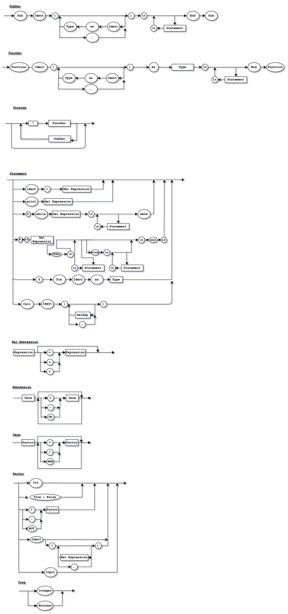

# IDJL - Raphael's Language
### Prerequisites

To run the compiler, the prerequisites are:
- Python 3.7.3 or later.
To see which version you are current using:
```Python
python -v
```

### Running
To compile, write a .vbs file, and run:
```Python
python main.py file.idjl
```

### Example of code
An example of code that the compiler runs is like the above, that is a recursive Fibonacci calculator
```VBS
^ function fibonacci(n as integer) as integer
    @ dim flag as boolean
    flag = false
    # if n = 0 then
        fibonacci = 1
        flag = true
    end if
    # if n = 1 then 
        fibonacci = 1
        flag = true
    end if
    # if flag = false then
        fibonacci = fibonacci(n-2) + fibonacci(n-1)
    end if
end function
^ sub Main()
    print fibonacci(5)
    @ dim x as integer
    x = 0
    $ while x < 3 then
        x = x + 1
        print x
    wend
end sub
```
Output
```Python
8
1
2
3
```

### Syntax diagram


### EBNF

```
SubDec = Sub Ident '(' {(Null | Ident As Type | ',')} ')' '\n' {(Null | Statement '\n')} End Sub
```

```
FuncDec = Function Ident '(' {(Null | Ident As Type | ',')} ')' As Type '\n' {(Null | Statement '\n')} End Function
```

```
Program = {'^' (SubDec | FuncDec)}
```

```
Statement = Null, 
            Ident '=' RelExp,
            "Print" RelExp,
            '$' While RelExp '\n' {(Null | Statemente '\n')} Wend,
            '#' If RelExp then '\n' {(Null | Statement '\n')} (Null | Else '\n' {(Null | Statement '\n')}) End If,
            '@' Dim Ident as Type,
            Call Ident '(' {(Null | RelExp | ',')} ')'
```

```
RelExp = Expression (Null | ("=" | ">" | "<") Expression)
```

```
Expression = Term (Null | {('+'|'-'|'or') Term })
```

```
Term = Factor (Null | {('*'|'/'|'not') Factor})
```

```
Factor = Int,
         (True | False),
         ('+'|'-'|'not') Factor,
         Ident (Null | '(' {(Null | RelExp | ',')} ')'),
         Input
```

```
Type = (Integer | Boolean)
```
